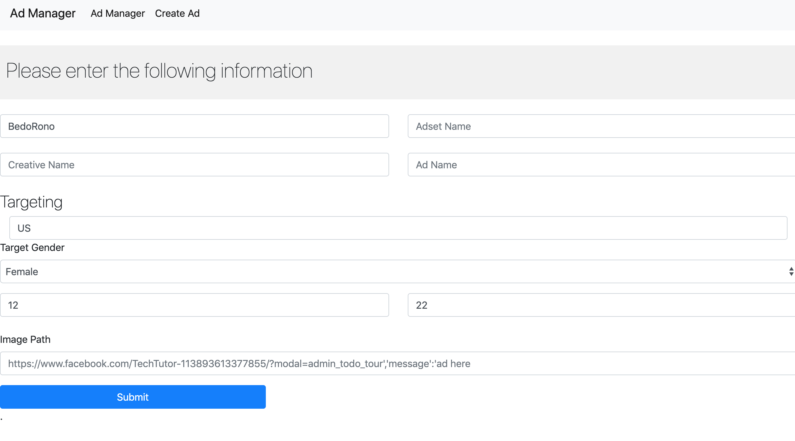
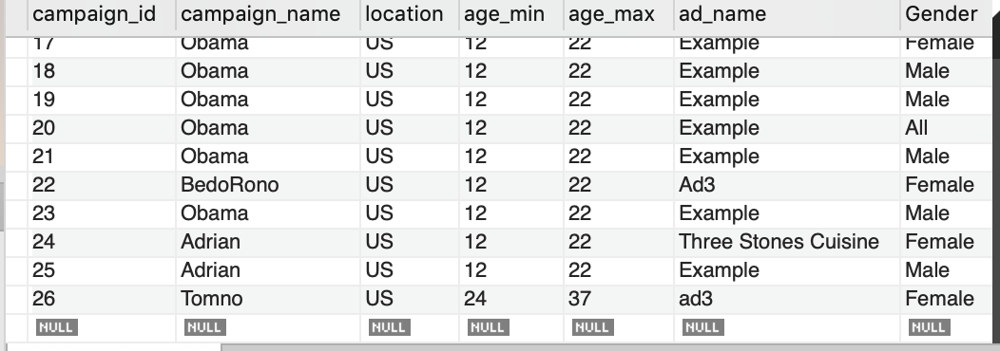
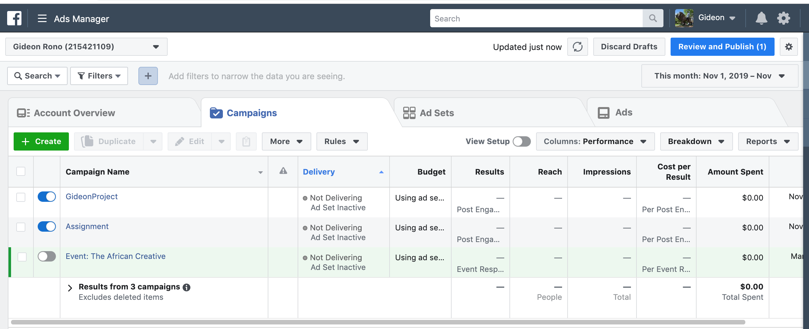

# AdPublisher
script + web app to publish Facebook ads

This ad publisher allows the user to enter some details that will then run a targeted facebook campaign. Some of the details required are Campaign Name, Ad image and Creative Name. For targeting, the code can be custom made to target specific demographics, gender and age group. The details will then populate a MySQL database to keep records.


Here is the page view:


## Ad Publisher Homepage
<br><br>

## SQL View
<br><br>

## Ad Manager View
<br><br>


# How to run
- First, install all the requirements needed from the requirements.txt file


```python
pip install -r requirements.txt
```

- Run:

```python
python3 server.py
```

- Load your browser and enter the link: 

```python
http://127.0.0.1:5000/index
```

- You can then use the navigation bar and different menus to navigate

:+1:  **_ _Ready!!_ to run some fb ads **  :shipit:


#  Libraries/frameworks you used

### Flask Backend
I used Flask to write the backend for the Web App. 

### Database
MySQL database. 

### Web App Frontend
I used a mix of HTML, Bootstrap and Javascript for the user to enter values to run a Facebook campaign.

